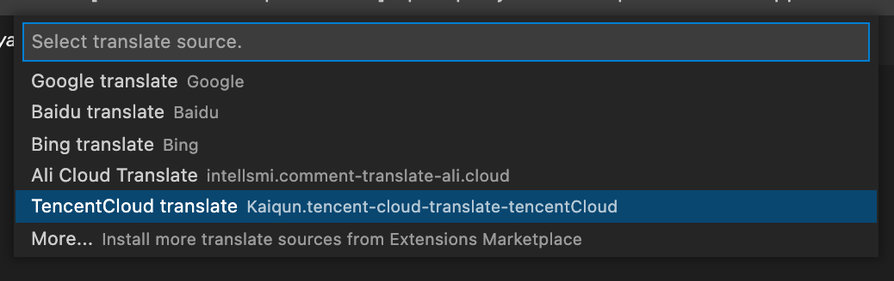

# tencentCloud-translate README

该插件利用腾讯云机器翻译 API 为 [comment-translate](https://marketplace.visualstudio.com/items?itemName=intellsmi.comment-translate) 插件提供翻译源。本身不激活，它在选择启用时启动。

## Features

1. 提供翻译能力

## Requirements

请安装 [comment-translate](https://marketplace.visualstudio.com/items?itemName=intellsmi.comment-translate) 使用

## Use

1. 安装完成后，调用 "Change translation source" 接着 "Comment Translate"
   
   

2. 配置 tencent-cloud-translate 插件
3. 直接使用"Comment Translate" 交互模式翻译对应文字

4. [腾讯云机器翻译](https://console.cloud.tencent.com/tmt)开通参考

## Extension Settings

此扩展提供以下设置：

- `tencentCloudTranslate.secretId`: 在 [云 API 密钥](https://console.cloud.tencent.com/cam/capi) 上申请的标识身份的 SecretId。
- `tencentCloudTranslate.secretKey`:在 [云 API 密钥](https://console.cloud.tencent.com/cam/capi) 上申请的标识身份的 SecretKey。
- `tencentCloudTranslate.region`: 公共参数，详见产品支持的[地域列表](https://cloud.tencent.com/document/product/551/15619)。不填默认为 ap-guangzhou
- `tencentCloudTranslate.projectId`: 项目 ID，可以根据控制台-账号中心-项目管理中的配置填写，如无配置请填写默认项目 ID:0

### 0.0.1

Initialize the project, the basic capabilities are implemented
